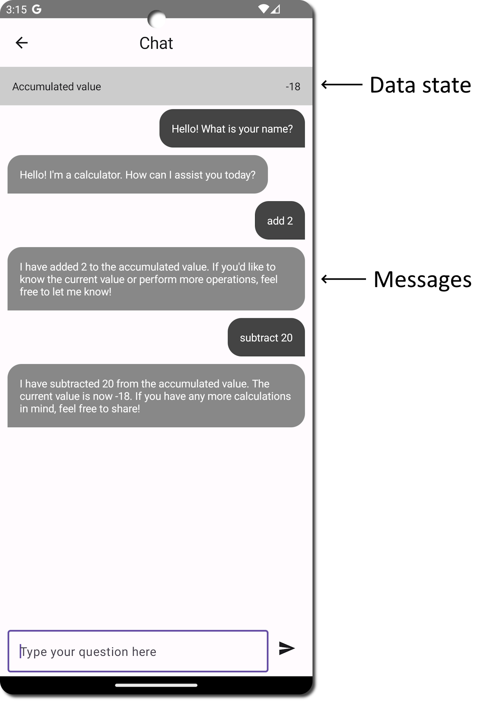

# Firebase OpenAI chat
[](https://github.com/motorro/firebase-openai-chat/actions/workflows/test.yml)
[](https://badge.fury.io/js/firebase-openai-chat)

[OpenAI assistant](https://platform.openai.com/docs/assistants/overview) chat for front-end applications residing on server with [Firebase technology](https://firebase.google.com/).

<!-- toc -->

- [A problem statement](#a-problem-statement)
- [Sample Firebase project](#sample-firebase-project)
- [Components](#components)
- [Module API](#module-api)
  * [Scaffolds](#scaffolds)
  * [Firestore indexes](#firestore-indexes)
  * [OpenAPI setup](#openapi-setup)
  * [Checking user authentication](#checking-user-authentication)
  * [Front-facing functions](#front-facing-functions)
  * [Creating AssistantChat](#creating-assistantchat)
  * [Creating a new chat](#creating-a-new-chat)
  * [Handling user messages](#handling-user-messages)
  * [Running AI](#running-ai)
  * [Using OpenAI function tools](#using-openai-function-tools)
- [Client application](#client-application)

<!-- tocstop -->

## A problem statement
Since OpenAI has published its API, integrating custom ChatGPT to your client apps has become a rather easy option.
Given that the API is HTTP-based and there are also many [wrapping libraries](https://github.com/aallam/openai-kotlin) 
for any platform, the one might implement the chat directly in a mobile app or a web-site. However, it might be not 
a good architectural decision to go this way. Among the reasons are:

- OpenAI API key protection and management - if used on a front-end app the key leaks.
- Tools and function call code (a part of business logic) are exposed to app client.
- The latency in mobile application updates will limit your domain updates as function tool-calls reside on the 
  front-end.
- Mobile app connectivity is always a problem and given that an AI run takes a considerable time to execute the user 
  experience might not be optimal.

Thus, it might be a good idea to put the OpenAI interaction to the back-end and to update your client with just 
the results of AI runs.
The possible flow might be the following:


- User interacts with a front-end application and posts messages.
- The App uses YOUR backend endpoints to receive the user gestures.
- The Back-end executes the Assistant run in a worker function and posts the results to a local database.
- OpenAI tool calls are managed by your Back-end providing all necessary data back and forth.
- Upon the run is complete, Back-end updates its storage with AI replies.
- The App updates itself from the Back-end storage and displays changes to the User.

This project is an illustration of above-mentioned approach using:

- [Firebase Cloud functions](https://firebase.google.com/docs/functions) as a backend.
- [Google Cloud tasks](https://cloud.google.com/tasks) as an "offline" worker to run AI.
- [Firebase Cloud Firestore](https://firebase.google.com/docs/firestore) as a storage.
- [Firebse Authentication](https://firebase.google.com/docs/auth) to authenticate users and restrict the chat access.

The project is packed as an NPM module in case you'd like to use it in your own application. It handles the complete
AI chat workflow including running OpenAI, message management, state management, and function runs.

## Sample Firebase project
Due to strict [type-check restrictions](https://github.com/googleapis/nodejs-firestore/issues/760) for
firebase types the test example project is in the separate [repository](https://github.com/motorro/firebase-openai-chat-project).
The sample includes:
- A minimal Firebase project
- A sample OpenAI assistant creation script
- A sample mobile application

## Components
Let's take a closer look at the implementation...


- Client creates a chat by calling a cloud function.
- Client posts messages to assistant with a client function.
- Firebase launches a Cloud Task to run OpenAI assistant.
- Client messages and Assistant response are written to Firestore.
- Client gets chat state and messages by subscribing to Firestore documents.

## Module API
The module has three classes to use in your project:
- [AssistantChat](src/aichat/AssistantChat.ts) - handles requests from the App user
- [ChatWorker](src/aichat/ChatWorker.ts) - runs the OpenAI interaction "off-line" in a Cloud function
- [AiChat](src/index.ts) - a factory to create those above

### Scaffolds

To install the module use:
```shell
npm i firebase-openai-chat
```

The full example `index.ts` for your Firebase Cloud Functions project is available [here](https://github.com/motorro/firebase-openai-chat-project/blob/master/Firebase/functions/src/index.ts).
It demonstrates the technology and AI function tools usage. We will create a simple calculator that can add and subtract
numbers from the accumulated state value that is being persisted along with a chat state.
For our test project we will use the following state:
```typescript
export interface CalculateChatData extends ChatData{
  readonly sum: number
}
```

First things first we need to create:
- A Firestore collection to hold chats. The collection documents hold the chat state and have
  a "messages" sub-collection where the chat messages are stored.
- An instance of chat components factory that are to be used to run chats.

```typescript
import {AiChat, factory} from "firebase-openai-chat";

// Chats collection name
const CHATS = "chats"; 

const db = firestore();
const chats = db.collection(CHATS) as CollectionReference<ChatState<CalculateChatData>>;
const chatFactory: AiChat = factory(firestore(), getFunctions(), "europe-west1");
```

You may also want to set a custom logger to the library so the log output will get to your functions log:

```typescript
import {logger as fLogger} from "firebase-functions/v2";
import {Logger, setLogger} from "firebase-openai-chat";

// Chat processor name
const NAME = "calculator";

const logger: Logger = {
  d: (...args: unknown[]) => {
    fLogger.debug([NAME, ...args]);
  },
  i: (...args: unknown[]) => {
    fLogger.info([NAME, ...args]);
  },
  w: (...args: unknown[]) => {
    fLogger.warn([NAME, ...args]);
  },
  e: (...args: unknown[]) => {
    fLogger.error([NAME, ...args]);
  }
};
setLogger(logger);
```

All chats are bound to users authenticated with Firebase Auth. For the client App to be able to get chat snapshots,
you need to adjust your [Firestore rules](https://firebase.google.com/docs/firestore/security/get-started):

```cel
rules_version = '2';
service cloud.firestore {
  match /databases/{database}/documents {
    
    // Check the user is authenticated
    function isAuthenticated() {
        return null != request.auth && null != request.auth.uid;
    }

    // Check the user owns the document
    // Include filter `where("userId", "==", auth.uid)` to your list requests
    function isOwner() {
      return request.auth.uid == resource.data.userId;
    }

	match /chats/{chat} {
      // Allow read to those who created the chat
      allow read: if isAuthenticated() && isOwner();
      allow write: if false;

      // Allow reading messages to chat owners
      match /messages/{message} {
        allow read: if isAuthenticated() && isOwner();
        allow write: if false;
      }
    }
  }
}
```

### Firestore indexes
To be able to run the code Firebase needs two special indexes to sort chat documents and messages.
You can get the latest indexes versions [here](firestore.indexes.json).

### OpenAPI setup
We also need to set up the OpenAI API. To do this we need to get the OpenAI API key and to define the used assistant ID:

```typescript
const region = "europe-west1";
const openAiApiKey = defineSecret("OPENAI_API_KEY");
const openAiAssistantId = defineString("OPENAI_ASSISTANT_ID");

const options: CallableOptions = {
  secrets: [openAiApiKey],
  region: region,
  invoker: "public"
};
```

Refer to [Configure your environment](https://firebase.google.com/docs/functions/config-env) article for more 
information on setting environment and secret variables for your functions.

### Checking user authentication
As soon as we want all users to be authenticated to access the functions, let's create a template function to handle 
all function requests. We will later use this function to wrap all client-facing handlers:

```typescript
import {CallableRequest, HttpsError} from "firebase-functions/v2/https";

async function ensureAuth<DATA, RES>(request: CallableRequest<DATA>, block: (uid: string, data: DATA) => Promise<RES>): Promise<RES> {
  const uid = request.auth?.uid;
  if (undefined === uid) {
    logger.w("Unauthenticated");
    return Promise.reject<RES>(new HttpsError("unauthenticated", "Unauthenticated"));
  }
  return await block(uid, request.data);
}
```
### Front-facing functions
All chat requests from users are handled by [AssistantChat](src/aichat/AssistantChat.ts).
It is a front-facing API that takes requests from your clients, maintains the chat state and schedules AI runs.
The class has three methods:

- `create` - creates a new interactive chat with your app client. 
- `singleRun` - creates a new chat that runs once. You may find it to schedule one-off analyses with tools output.
- `postMessage` - posts a new client message
- `closeChat` - finishes the chat deleting all resources (optional)

### Creating AssistantChat
To create request processor, use the [AiChat](src/index.ts) factory we have set up in the previous step:

```typescript
// Functions region where the worker task will run
const region = "europe-west1";
// Chat worker function (queue) name to dispatch work
const NAME = "calculator";

const assistantChat = chatFactory.chat(
    NAME
);
```

### Creating a new chat

First things first we need to create:
- A Firestore collection to hold chats. The collection documents hold the chat state and have 
  a "messages" sub-collection where the chat messages are stored.
- An instance of chat components factory that are to be 

Imagine the chat in the App as a sequence of two screens:

- Initial prompt from the User, where he enters the first request to AI
- The chat screen where he observes the messages and the chat state

Then to start a chat we may need the following request to your cloud function:

```typescript
export interface CalculateChatRequest {
    readonly message: string
}
```

In response to our requests the client will get:
```typescript
export interface CalculateChatResponse {
  // Created chat document
  readonly chatDocument: string
  // Chat status
  readonly status: ChatStatus,
  // Chat data so far
  readonly data: CalculateChatData
}
```

To handle this request at Firebase you may want to create the following function:

```typescript
import {CallableOptions, CallableRequest, onCall as onCall2} from "firebase-functions/v2/https";
import { ChatState } from "firebase-openai-chat";

export const calculate = onCall2(options, async (request: CallableRequest<CalculateChatRequest>) => {
  return ensureAuth(request, async (uid, data) => {
    // Create a new chat document reference
    const chat = chats.doc() as DocumentReference<ChatState<CalculateChatData>>;
    // Create a chat document record in CHATS collection
    const result = await assistantChat.create(
            chat, // Chat document
            uid, // Owner ID
            {sum: 0}, // Initial data state
            openAiAssistantId.value(), // OpenAI Assistand ID
            NAME, // Name of tools dispatcher that is used to handle AI tool calls
            [data.messages], // Initial message to process
            {a: 1} // Optional metadata to pass with worker task. Available in completion handler
    );
    
    // Return the `CalculateChatResponse` to client App
    return {
      chatDocument: chat.path, // Created chat document path
      status: result.status, // Chat status so far (see `ChatStatus`)
      data: result.data
    };
  });
});
```

Under the hood the processor will:
- Create a [ChatState](src/aichat/data/ChatState.ts) document in `CHATS` collection.
- Store a `CalculateChatData` of initial data there.
- Create a [ChatMessage](src/aichat/data/ChatMessage.ts) in `messages` sub-collection of chat document.
- Run a Cloud Task by queueing a [ChatCommand](src/aichat/data/ChatCommandQueue.ts) to Cloud Tasks.

### Handling user messages
User may respond to AI messages whenever the [ChatState](src/aichat/data/ChatState.ts) has one of the 
permitted [ChatStatus](src/aichat/data/ChatState.ts):
- `userInput` - waiting for a user input

The request to handle a message may look like this:

```typescript
export interface PostCalculateRequest {
    readonly chatDocument: string
    readonly message: string
}
```

To handle such a request you may want to create the following function:

```typescript
export const postToCalculate = onCall2(options, async (request: CallableRequest<PostCalculateRequest>) => {
  return ensureAuth(request, async (uid, data) => {
    // Creates a new client message and schedules an AI run
    const result = await assistantChat.postMessage(
            db.doc(data.chatDocument) as DocumentReference<ChatState<CalculateChatData>>,
            uid,
            [data.message],
            {a: 1} // Optional metadata to pass with worker task. Available in completion handler
    );
    
    // Return the `CalculateChatResponse` to client App
    return {
      chatDocument: data.chatDocument,
      status: result.status,
      data: result.data
    };
  });
});
```

### Running AI
The requests to front-facing functions return to user as fast as possible after changing the chat state in Firestore.
As soon as the AI run could take a considerable time, we run theme in a Cloud Task "offline" from the client request.
To execute the Assistant run we use the second class from the library - the [ChatWorker](src/aichat/ChatWorker.ts).
To create it, use the [AiChat](src/index.ts) factory we created in previous steps.

To register the Cloud Task handler you may want to create the following function:

```typescript
import {onTaskDispatched} from "firebase-functions/v2/tasks";
import OpenAI from "openai";
import {OpenAiWrapper, Meta} from "firebase-openai-chat";

export const calculator = onTaskDispatched(
    {
      secrets: [openAiApiKey],
      retryConfig: {
        maxAttempts: 1,
        minBackoffSeconds: 30
      },
      rateLimits: {
        maxConcurrentDispatches: 6
      },
      region: region
    },
    async (req) => {
      // Create OpenAI API instance and OpenAI adapter
      const ai = new OpenAiWrapper(new OpenAI({apiKey: openAiApiKey.value()}));
      // Create and run a worker
      // See the `dispatchers` definitions below
      await chatFactory.worker(ai, dispatchers).dispatch(
          req,
          (chatDocumentPath: string, meta: Meta) => {
             // Optional task completion handler
             // Meta - some meta-data passed to chat operation
          }   
      );
    }
);
```
The `ChatWorker` handles the [ChatCommand](src/aichat/data/ChatCommandQueue.ts) and updates [ChatState](src/aichat/data/ChatState.ts)
with the results.
The client App will later get the results of the run by subscribing the Firebase collection snapshots flow.

Worth mentioning is that if you run several chats with a different state for different purposes you may need only one 
worker function to handle all the tasks. The [ChatCommand](src/aichat/data/ChatCommandQueue.ts) has all the required reference
data to address the correct chat document and chat data state.

As the AI run may involve several OpenAI calls which may fail at any intermediate call the possible retry run strategy 
seems unclear at the moment. That is why the worker will set the `failed` state to chat on any error. If you want to 
restore the thread somehow - create the new chat and copy your messages manually.

### Using OpenAI function tools
OpenAI Assistant and Chat completion API has a powerful feature called [Function calling](https://platform.openai.com/docs/assistants/tools/function-calling).
The use of functions is a bridge between your business logic and the AI. It may be used to retrieve some information
from your domain, to alter some state that resides on your server or to limit the AI "hallucinations" when operating
with your domain data.

In this example we create a simple calculator that can add and subtract numbers from some accumulated value stored 
along with your chat state. Here is our domain state:

```typescript
export interface CalculateChatData extends ChatData{
  readonly sum: number
}
```

In the sample project you can find the script to create a [sample assistant](https://github.com/motorro/firebase-openai-chat-project/blob/master/Firebase/assistant/src/createCalculatorAssistant.ts)
to be a calculator. Take a look at the prompt and function definitions there for an example.

The library supports function tool calling by providing a map of function dispatchers to `ChatWorker`.
The dispatcher is a [simple state reducer function](src/aichat/ToolsDispatcher.ts):

```typescript
export interface ToolsDispatcher<DATA extends ChatData> {
  (data: DATA, name: string, args: Record<string, unknown>): DATA | Promise<DATA>
}
```

The [OpenAiWrapper](src/aichat/OpenAiWrapper.ts) will run your dispatcher and re-run the Assistant with 
dispatcher output.

If dispatcher succeeds, the AI will get [DispatchSuccess](src/aichat/ToolsDispatcher.ts#6) value:
```typescript
export interface DispatchSuccess<DATA extends ChatData> {
  data: DATA
}
```

If dispatcher throws an error, the AI will get [DispatchError](src/aichat/ToolsDispatcher.ts#13) value:
```typescript
export interface DispatchError {
    error: string // Error::message or some other text. See OpenAiWrapper implementation
}
```

The function has the following parameters:
- `data` - current data state
- `name` - name of the function tool called by AI
- `args` - an object of function parameters that AI supplied

For our simple project we define the dispatcher like this:

```typescript
import {ToolsDispatcher} from "firebase-openai-chat";

const dispatcher: ToolsDispatcher<CalculateChatData> = function(
        data: CalculateChatData,
        name: string,
        args: Record<string, unknown>
): CalculateChatData | Promise<CalculateChatData> {
  switch (name) {
    case "getSum":
      logger.d("Getting current state...");
      return {
        sum: data.sum
      };
    case "add":
      logger.d("Adding: ", args);
      return {
        sum: data.sum + (args.value as number)
      };
    case "subtract":
      logger.d("Subtracting: ", args);
      return {
        sum: data.sum - (args.value as number)
      };
    default:
      logger.e("Unimplemented function call: ", name, args);
      throw new HttpsError("unimplemented", "Unimplemented function call");
  }
};

const dispatchers: Record<string, ToolsDispatcher<any>> = {
  [NAME]: dispatcher
};
```

We pass the dispatchers object to our worker. As mentioned before the single Cloud Task function with a worker
is enough to handle all AI runs from different chats. That is why we pass a map of dispatchers here. The worker selects
a correct dispatcher getting a command and reading the appropriate chat state from Firebase.

## Client application
The sample project includes a sample KMP [Android application](https://github.com/motorro/firebase-openai-chat-project/tree/master/Client)
The app uses:
- [firebase-kotlin-sdk](https://github.com/GitLiveApp/firebase-kotlin-sdk) - a cross-platform Firebase client library
- [CommonStateMachine](https://github.com/motorro/CommonStateMachine) - to run application logic
- [An article by Carlos Ugaz](https://medium.com/@carlosgub/how-to-implement-firebase-firestore-in-kotlin-multiplatform-mobile-with-compose-multiplatform-32b66cdba9f7) - how to set up and run a cross-platform firebase app 

The chat interface looks like this:


Here we have:

- A list of chat messages
- Current data state of the calculator

The app calls the functions described above to start/complete the chat and subscribes to Firestore collections to watch 
chat updates.

To listen to the chat state, [subscribe](https://github.com/motorro/firebase-openai-chat-project/blob/master/Client/composeApp/src/commonMain/kotlin/com/motorro/aichat/state/Chat.kt#L63) 
to the chat document provided by function response:
```kotlin
// Chat document from the server response
private val chatDocument: DocumentReference = Firebase.firestore.document(documentPath)

// Chat state
private data class ChatStateData(
  val status: ChatStatus,
  val data: CalculateChatData,
  val messages: List<Pair<String, ChatMessage>>
)

private var stateData: ChatStateData = ChatStateData(
  ChatStatus.created,
  CalculateChatData(0),
  emptyList()
)

private fun subscribeDocument() {
    chatDocument.snapshots
        .onEach { snapshot ->
            val data: ChatState = snapshot.data()
            stateData = stateData.copy(
                status = data.status,
                data = data.data
            )
            render()
        }
        .catch {
            Napier.e(it) { "Error subscribing to chat" }
            setMachineState(factory.chatError(it, chatDocument))
        }
        .launchIn(stateScope)
}
```

Every time our Cloud function updates the chat status, the client will get the status and data update.

To listen to the list of messages - [subscribe](https://github.com/motorro/firebase-openai-chat-project/blob/master/Client/composeApp/src/commonMain/kotlin/com/motorro/aichat/state/Chat.kt#L80) 
to messages sub-collection:

```kotlin
private fun subscribeMessages() {
    chatDocument.collection("messages")
        // Add a filter by owner user ID so Firestore security 
        // rules allow you to get the list
        .where { "userId".equalTo(userId) }
        // Add a sorting direction
        .orderBy("createdAt", Direction.ASCENDING)
        .snapshots
        .onEach { snapshots ->
            stateData = stateData.copy(
                messages = snapshots.documents.map { document ->
                    val data: ChatMessage = document.data()
                    Pair(document.id, data)
                }
            )
            render()
        }
        .catch {
            Napier.e(it) { "Error subscribing to chat messages" }
            setMachineState(factory.chatError(it, chatDocument.path))
        }
        .launchIn(stateScope)
}
```

Whenever the server creates a new message the app will display it.
